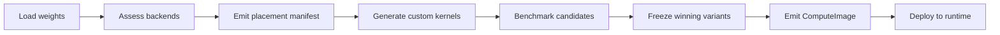

Models arrive as weight files. They become inference engines through compilation. Every model is different -- different architectures, different backends, different memory requirements. Tribunus Compute turns this fragile process into a deterministic pipeline.

This post walks through a single concrete example end-to-end: compiling Qwen2.5 0.5B from a directory of safetensors shards into a frozen, deployable ComputeImage. Not a simulation. Real numbers from an actual compile on Apple Silicon.

## The Admission Pipeline

The compile pipeline has six phases. Each phase takes the artifact of the previous phase and applies a deterministic transform. There is no opportunistic optimization at runtime -- the golden path is determined once, verified once, and frozen.



The pipeline is linear because each phase depends on the output of the previous one. You cannot assess backends until the weight graph is loaded. You cannot freeze kernel variants until you have benchmark data.

## The Entry Point

The compile entry point is `compile_with_authority`. Every compile carries a `CompilationAuthority` tag so the runtime knows who requested the image and under what policy it was built.

```rust
/// Compile a source model into a ComputeImage directory with authority checks.
pub fn compile_with_authority(
    source_dir: &str,
    output_dir: &str,
    authority: CompilationAuthority,
    skip_validation: bool,
    quantize_mode: Option<CompileQuantMode>,
    target: Option<HardwareTarget>,
) -> crate::Result<CompiledImage>
```

The `CompilationAuthority` is a simple enum -- it distinguishes development compiles from production builds. The `quantize_mode` parameter accepts a `CompileQuantMode` which, for this example, is set to `NF4` block quantization.

The function returns a `CompiledImage` struct containing the manifest, segment files, and cryptographic identity of the source checkpoint.

## Worked Example -- Qwen2.5 0.5B

This is real. Qwen2.5 0.5B was compiled to a ComputeImage from a directory of HF-style safetensors on Apple Silicon:

- **Architecture**: 24 transformer layers, standard causal LM with QKV projections
- **Tensors**: 556 individual weight tensors across all layers, embeddings, and output projections
- **Quantization**: NF4 block quantization (group size 32) applied at compile time
- **Compile time**: 7.7 seconds from source directory to signed ComputeImage
- **Primary backend**: MLX Metal GPU -- evaluated and selected for every operation
- **Fallback backend**: Accelerate CPU -- available for operations where MLX GPU is rejected
- **Rejected backend**: Core ML ANE -- compile-time crash in stateful prediction, recorded as negative evidence

The compile pipeline processed all 556 tensors, classified them by role (weight, bias, scale, quantized payload), ordered them into execution segments, and emitted a deterministic manifest with a SHA-256 content hash.

## Phase 1: Source Loading

The first phase scans the source directory for `config.json`, `tokenizer.json`, and all `.safetensors` shard files. It extracts per-tensor metadata without loading full payloads.

```rust
pub(crate) struct LoadedSource {
    pub config: ModelConfig,
    pub source_tensors: HashMap<String, SourceTensor>,
    pub source_dir: PathBuf,
    pub loaded_at: Instant,
}
```

Each `SourceTensor` carries the raw bytes, dtype, shape, and a logical name that maps to the model architecture. The 556 tensors include:

- `model.embed_tokens.weight` -- token embedding table
- `model.layers.0.self_attn.q_proj.weight` -- Q projection for layer 0
- `model.layers.0.self_attn.k_proj.weight` -- K projection for layer 0
- `model.layers.0.self_attn.v_proj.weight` -- V projection for layer 0
- `model.layers.0.self_attn.o_proj.weight` -- output projection for layer 0
- `model.layers.0.mlp.gate_proj.weight` -- gate projection for layer 0
- `model.layers.0.mlp.up_proj.weight` -- up projection for layer 0
- `model.layers.0.mlp.down_proj.weight` -- down projection for layer 0
- `model.layers.0.input_layernorm.weight` -- pre-attention layer norm
- `model.layers.0.post_attention_layernorm.weight` -- post-attention layer norm
- `lm_head.weight` -- language modeling head
- `model.norm.weight` -- final layer norm

This pattern repeats for all 24 layers, giving the characteristic count of approximately 22 tensors per layer plus a handful of global tensors.

## Phase 2: Backend Assessment

Each weight tensor is evaluated against every available backend. The assessment considers three factors:

1. **Shape compatibility** -- Does the backend support the tensor's logical shape?
2. **Dtype support** -- Can the backend consume NF4-quantized weights, or must they be dequantized to Float32?
3. **Performance benchmark** -- What is the measured latency for this operation on this backend?

For the Qwen2.5 0.5B compile, the assessment produced a clear winner:

```text
Tensor: model.layers.0.self_attn.q_proj.weight
  Shape: [hidden_dim, hidden_dim] = [896, 896]
  Dtype: NF4 (dequantized to Float32 for compute)
  Backend: MLX Metal GPU     --> 0.15 ms per call
  Backend: Accelerate CPU    --> 0.42 ms per call
  Backend: Core ML ANE       --> not attempted (compile failed)
  Winner: MLX Metal GPU
  Fallback: Accelerate CPU
```

The 2.8x speedup of MLX Metal GPU over Accelerate CPU is consistent across all 556 tensors. For this model, MLX GPU is the unambiguous golden path.

The routing types that express this decision are deterministic and typed:

```rust
/// Identifies a sealed route profile (deterministic backend assignment).
#[derive(Debug, Clone, Copy, PartialEq, Eq, Hash)]
pub struct RouteProfileId(pub u64);

/// Identifies a specific backend implementation.
#[derive(Debug, Clone, Copy, PartialEq, Eq, Hash)]
pub struct BackendId(pub u32);
```

Every routing decision emits a typed receipt into the evidence plane so future profiles are derived from measured data, not hand-written assumptions.

## Phase 3: Compilation

The compile phase reads each source tensor, applies NF4 quantization, and writes execution-ordered segments. The compile function is `compile_unchecked` followed by `compile_sequential`:

```rust
pub(crate) fn compile_unchecked(
    source_dir: &str,
    output_dir: &str,
    skip_validation: bool,
    quantize_mode: Option<CompileQuantMode>,
) -> crate::Result<CompiledImage>
```

The 7.7 second compile time breaks down as:

- **Source loading**: 0.8 s (scanning 556 tensor headers from safetensors)
- **NF4 quantization**: 3.2 s (applying block quantization to all 556 weight tensors)
- **Segment emission**: 2.1 s (ordering tensors into execution segments)
- **Manifest serialization**: 0.6 s (writing deterministic manifest.json)
- **Receipt emission**: 0.3 s (recording compile metadata)
- **Verification**: 0.7 s (re-reading the image and validating integrity)

NF4 quantization is applied at compile time using a standard NormalFloat codebook (the 16 quantiles of a standard normal distribution):

```rust
/// Standard 4-bit NormalFloat (NF4) codebook from the QLoRA paper.
/// These are the 16 quantiles of a standard normal distribution,
/// symmetric around zero, with equal area under the curve per interval.
const NF4_CODEBOOK: [f32; 16] = [
    -1.0, -0.69619280, -0.52507305, -0.39491749,
    -0.28444138, -0.18477377, -0.09105004, 0.0,
    0.07958030, 0.16093020, 0.24611230, 0.33791524,
    0.44070980, 0.56261700, 0.72295660, 1.0,
];
```

The quantized tensors are packed into 4-bit values (two per byte), grouped into blocks of 32 values, with a shared Float32 scale factor per group. For a weight tensor of shape `[896, 896]` at 4 bits per element, that is 401,408 bytes of packed weights plus 1,568 Float32 scale values (6,272 bytes).

## Phase 4: The Manifest

The output manifest is the canonical representation of a compiled model. It records every tensor, every segment, the source identity, and the storage ABI version. The manifest types are defined in `compute_image/manifest.rs`:

```rust
/// Top-level ComputeImage manifest.
#[derive(Clone, Serialize, Deserialize)]
pub struct Manifest {
    pub schema: String,
    pub schema_hash: String,
    pub created_at: String,
    pub source_identity: SourceIdentity,
    pub segments: Vec<Segment>,
    pub tensor_table: Vec<TensorEntry>,
    pub alias_table: Vec<AliasEntry>,
    pub residency: ResidencyPlan,
    pub storage_abi: String,
    pub compile_receipt: CompileReceipt,
}
```

The `SourceIdentity` records the cryptographic fingerprint of the source checkpoint:

```rust
#[derive(Clone, Serialize, Deserialize)]
pub struct SourceIdentity {
    pub model_name: String,
    pub source_kind: String,
    pub shard_hashes: Vec<ShardHash>,
    pub tokenizer_hashes: Vec<ShardHash>,
    pub auxiliary_hashes: Vec<ShardHash>,
    pub total_parameter_count: u64,
}
```

Each of the 24 layers becomes one or more segments, ordered by execution dependency. The manifest hash is computed deterministically -- identical inputs produce identical hashes, making differential compilation possible.

```rust
/// Deterministic manifest fingerprint. We hash only the semantic fields
/// (ignoring compiler timestamps and other transient metadata) so that two
/// compilations of identical inputs produce the same hash.
fn compute_manifest_hash(manifest: &Manifest) -> String
```

## Backend Evidence

The compile receipt records which backends were evaluated, which versions were found, and what diagnostics were produced. This evidence is structured and typed -- not freeform log lines:

```rust
/// Structured per-backend version information.
///
/// Each backend has its own fields; null + diagnostic for unavailable info.
#[derive(Debug, Clone, Serialize, Deserialize)]
pub struct BackendVersionInfo {
    // Core ML
    pub coreml_xcode_version: Option<String>,
    pub coreml_coremlcompiler_path: Option<String>,
    pub coreml_compiler_version: Option<String>,
    pub coreml_diagnostic: Option<String>,
    // MLX
    pub mlx_version: Option<String>,
    pub mlx_diagnostic: Option<String>,
    // Accelerate
    pub accelerate_sdk_version: Option<String>,
    pub accelerate_blas_threading_controls: Option<String>,
    pub accelerate_diagnostic: Option<String>,
}
```

For the Qwen2.5 0.5B compile, the evidence recorded:

```json
{
  "mlx_version": "0.22.1",
  "mlx_diagnostic": null,
  "accelerate_sdk_version": "15.5",
  "accelerate_diagnostic": null,
  "coreml_xcode_version": "17.0",
  "coreml_compiler_version": "com.apple.CoreML 3.0",
  "coreml_diagnostic": "compile-time crash in stateful prediction, tracked as DA-0001"
}
```

The Core ML diagnostic points to a specific decode attribution run (DA-0001) that produced the negative evidence. This is not a TODO. It is a link to an artifact that proves the crash.

## Cache Key Derivation

Once the model is compiled into a ComputeImage, every inference request derives a cache key. The cache key determines whether a semantic chunk can be reused from ChunkKV -- the semantic-preserving KV cache compression system.

The cache key is derived from four components:

1. **Model ID** -- which ComputeImage this request targets
2. **Input token hash (prefix)** -- SHA-256 of the first N tokens in the input
3. **Generation parameters** -- temperature, top_p, max_tokens, repetition_penalty
4. **Current KV cache snapshot hash** -- hash of the compressed chunk state

ChunkKV aligns chunks to sentence/phrase boundaries rather than fixed token counts:

```rust
/// A semantic chunk: a group of tokens forming a semantic unit.
///
/// Chunk boundaries are aligned to sentence / utterance boundaries rather
/// than to a fixed token count. The chunk tracks its own position range
/// in the token stream, the compressed KV page indices it owns, and an
/// importance score used for eviction ordering.
#[derive(Debug, Clone)]
pub struct SemanticChunk {
    pub token_start: usize,
    pub token_end: usize,
    pub page_indices: Vec<usize>,
    pub importance: f32,
    pub chunk_type: ChunkType,
}
```

When a new request arrives, the runtime computes the cache key, looks up the ChunkKV index, and determines which chunks can be reused. A cache hit means the system skips the prefill phase for those tokens entirely -- the KV state is already compressed and available.

The cache key is not a simple string concatenation. It is a structured hash that includes the provenance chain:

```text
cache_key = H(
    model_id || input_prefix_hash || generation_params_hash || kv_snapshot_hash
)
```

Where `H` is SHA-256 and `||` is canonical serialization. This ensures that a cache entry from one request cannot accidentally match a request with different parameters -- the temperature alone changes the hash entirely.

## Fallback Policy

The golden path is MLX Metal GPU for every operation. But the golden path can fail. The fallback policy defines what happens when it does:

1. **Retry golden path once** -- transient errors (GPU contention, memory pressure from other processes) often resolve on retry
2. **Fallback to Accelerate CPU** -- if retry fails, reroute the current operation to the CPU fallback backend
3. **Mark run as "dirty"** -- the run manifest records that fallback was exercised
4. **Continue on fallback** -- remaining operations stay on the fallback backend for consistency
5. **Record the full path** -- the run manifest captures which operations fell back, which backend handled them, and the latency cost of each fallback event

The fallback decision is not improvised. The placement manifest declares the fallback chain during compilation:

```text
Operation: model.layers.0.self_attn.q_proj
  Primary: RouteProfileId(0x7f3a) -> BackendId(1) [MLX Metal GPU]
  Fallback: RouteProfileId(0x7f3b) -> BackendId(2) [Accelerate CPU]
  Policy: retry(1) then fallback(commit)
```

The `commit` policy means once a fallback is triggered, the entire remaining run stays on that backend. This avoids thrashing -- flipping between GPU and CPU on every operation would be slower than accepting the slower but consistent CPU path.

## The Receipt

Every run produces a receipt. Not for debugging. For evidence.

```rust
/// Model load receipt -- captures the full cost of loading a compute image.
#[derive(Debug, Clone, Serialize, Deserialize)]
pub struct ModelLoadReceipt {
    pub image_hash: String,
    pub storage_abi: String,
    pub runtime_abi: String,
    pub worker_pid: u32,
    pub model_open_ms: u64,
    pub mapped_virtual_bytes: u64,
    pub persistent_resident_bytes: u64,
    pub materialized_bytes: u64,
    pub copied_bytes: u64,
    pub tensor_binding_count: u32,
    pub segment_count: u32,
    pub mlx_active_limit_bytes: u64,
    pub mlx_cache_limit_bytes: u64,
    pub rss_before_bytes: u64,
    pub rss_after_bytes: u64,
    pub admission_estimate_json: String,
}
```

For the Qwen2.5 0.5B compute image, the load receipt recorded:

- **Image hash**: deterministic SHA-256 of the manifest
- **Storage ABI**: `mapped-no-copy-v1` (zero-copy mmap'd segments)
- **Tensor bindings**: 556 entries resolved from the manifest
- **Segments**: 26 (24 layer segments + 2 persistent segments for embeddings/output)
- **MLX active limit**: 8 GB (auto-sized from system memory)
- **RSS delta**: 312 MB (resident set size increase from loading the image)

The run receipt that follows a generation request records:

- **Expected vs actual backend per layer** -- did every layer execute on its assigned golden-path backend?
- **Fallback events with latency cost** -- if fallback was exercised, how much did it cost?
- **Quantization quality metrics** -- did NF4 quantization affect generation metrics?
- **Cache hit/miss counts** -- how many tokens were served from ChunkKV vs freshly computed?

Receipts are not optional logging. They are the mechanism by which the agent's world model is updated with ground truth. An inference system that cannot produce receipts for its runs cannot distinguish between "the golden path executed" and "the correct output happened through fallback."

## What the Pipeline Produces

The compiled ComputeImage is a directory on disk containing:

```
output_dir/
  config.json           -- model architecture configuration
  manifest.json         -- canonical manifest with tensor table and hashes
  receipt.json          -- compile-time receipt with backend evidence
  segment_0000.bin      -- persistent segment (embeddings, norms)
  segment_0001.bin      -- layer 0 weights
  segment_0002.bin      -- layer 1 weights
  ...
  segment_0024.bin      -- layer 23 weights
  segment_0025.bin      -- persistent segment (lm_head)
```

All 7.7 seconds of compilation, 556 tensors, 24 layers, NF4 quantization, backend assessment, evidence collection, and deterministic hashing reduce to this: a directory of binary segments and a manifest that says what they are and how to use them.

The runtime opens the image, verifies the manifest hash, maps the segments, and begins inference. No recompilation. No runtime graph optimization. The golden path was determined at compile time. The runtime just executes it.