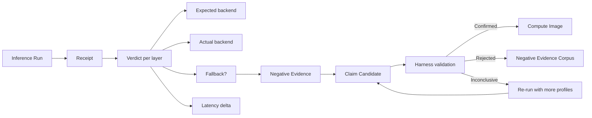

## The Silence Problem

Every AI infrastructure project publishes wins. Benchmarks that go up and to the right. Throughput gains from a new kernel. Accuracy improvements from a quantization scheme that didn't lose a single point on the eval suite.

The failures — the quantization mode that didn't converge, the Metal kernel that was slower than the reference, the Core ML island that compiled but crashed at runtime — those go into internal tickets, or they are forgotten entirely. Engineering blogs are victory laps. No one writes "we tried this and it didn't work."

This silence creates a quiet crisis. Teams copy each other's architectures without knowing which approaches were tried, measured, and rejected. A team in 2025 spends three months building a Core ML pipeline that another team proved couldn't reach latency targets in 2024 — but that proof died in a ticket that was never closed, on a laptop that was wiped when the engineer left. Cargo-cult engineering is not a personality flaw. It is an information architecture problem.

Tribunus treats this problem as a systems-design constraint, not a cultural aspiration. The evidence plane is not a suggestion box for post-mortem write-ups. It is a type system, a pipeline, and a storage layer designed so that negative results are as durable and queryable as positive ones.

---

## The Receipt Contract

Every execution in Tribunus produces a receipt. A receipt is not a log line or a telemetry event that you hope someone looks at when something breaks. It is a structured, typed proof of what actually happened during an inference run — which backends were available, which engine executed each operation, where fallback occurred, and what the delta was between expected and actual behavior.

```rust
/// Structured per-backend version information.
///
/// Each backend has its own fields; null + diagnostic for unavailable info.
#[derive(Debug, Clone, Serialize, Deserialize)]
pub struct BackendVersionInfo {
    // ── Core ML ──────────────────────────────────────────────────────────
    pub coreml_xcode_version: Option<String>,
    pub coreml_coremlcompiler_path: Option<String>,
    pub coreml_compiler_version: Option<String>,
    pub coreml_diagnostic: Option<String>,
    // ── MLX ──────────────────────────────────────────────────────────────
    pub mlx_version: Option<String>,
    pub mlx_diagnostic: Option<String>,
    // ── Accelerate ───────────────────────────────────────────────────────
    pub accelerate_sdk_version: Option<String>,
    pub accelerate_blas_threading_controls: Option<String>,
    pub accelerate_diagnostic: Option<String>,
}
```

Every field in `BackendVersionInfo` carries a diagnostic for when the version is unavailable. This is not decoration. A receipt from a machine without Core ML tells you not just that Core ML didn't run, but *why* — no compiler binary found, no Xcode path resolvable, the diagnostic string captured from the actual error.

The `ExecutionKind` enum tracks which engine actually ran a given operation, not which one was supposed to:

```rust
/// What engine actually executed the graph for this row.
#[derive(Debug, Clone, Serialize, Deserialize)]
pub enum ExecutionKind {
    /// The named backend ran the graph directly.
    NativeBackend,
    /// A CPU-specific domain adapter (not the generic reference evaluator).
    DomainCpuAdapter,
    /// The generic pure-Rust reference evaluator produced the output.
    ReferenceEvaluator,
    /// Intentionally unsupported family for this backend.
    Unsupported,
    /// Native bridge fault during execution; no engine reached predict.
    Crashed,
}
```

The `Crashed` variant is the most honest entry in this enum. Most systems would swallow a bridge fault and log "prediction failed." Tribunus records it with the same `ExecutionKind` type as a successful `NativeBackend` run. A crash is not a bug report. It is a receipt with `ExecutionKind::Crashed` and a `failure_reason` that captures the exact error.

The `ExecutionProof` struct adds per-operation granularity:

```rust
/// Structured proof of what engine executed each operation in this row.
#[derive(Debug, Clone, Serialize, Deserialize)]
pub struct ExecutionProof {
    /// Engine identifier: "coreml", "mlx", "accelerate", "reference", "domain_cpu".
    pub engine: String,
    /// Operations executed by the named backend.
    pub accelerated_ops: Vec<String>,
    /// Operations executed by CPU fallback/adapter.
    pub cpu_ops: Vec<String>,
    /// Operations executed by the generic reference evaluator.
    pub reference_ops: Vec<String>,
    /// Accelerate BLAS operations (e.g., "matmul:cblas_sgemm").
    pub accelerate_blas_ops: Vec<String>,
    /// Accelerate vDSP operations (e.g., "add:vDSP_vadd", "mul:vDSP_vmul").
    pub accelerate_vdsp_ops: Vec<String>,
    /// Accelerate vForce operations (e.g., "sigmoid:vvexpf").
    pub accelerate_vforce_ops: Vec<String>,
    /// Tribunus-owned CPU glue (scalar loops, negate, reciprocal, etc.).
    pub cpu_glue_ops: Vec<String>,
    /// Backend execution path (Core ML model path, MLX eval path).
    pub bridge_path: Option<String>,
    pub notes: Option<String>,
}
```

This is what makes evidence different from telemetry. A log line says "backend responded." A receipt says "backend A ran these 7 operations natively, backend B handled these 3 through a domain adapter, and 2 operations fell through to the reference evaluator because no backend supported the shape profile."

The decode attribution harness orchestrates the receipt pipeline through nine explicit phases:

1. **Materialize** — Build MIL program via `MilBuilder`, write `.mlpackage`.
2. **Compile** — Invoke `xcrun coremlcompiler` via `compile_mlpackage`.
3. **Load** — Load compiled model via `CoreMlModel::load_with_compute_units`.
4. **MLComputePlan** — Attempt compute-plan inspection (stub, non-blocking).
5. **Cold predict** — First prediction.
6. **Warmup** — Warmup predictions.
7. **Steady state** — Timed predictions with statistics.
8. **Reference conformance** — Compare against pure-Rust evaluator.
9. **Accelerate** — Accelerate backend where supported.

Phases 1-3 are fully implemented today. The fact that phases 4-9 are stubs is itself a kind of negative evidence captured in the code: "we know this pipeline is incomplete, and the receipt for any run through it will show exactly which phases produced meaningful data."

---

## Evidence Pipeline



The pipeline is explicit: an inference run produces a receipt. Each layer in the receipt carries a verdict — expected backend, actual backend, whether fallback occurred, and the latency delta between expected and actual. When fallback happens, the receipt feeds into a negative-evidence capture, which becomes a claim candidate, which goes through harness validation. The result is either confirmation (into the compute image), rejection (into the negative evidence corpus), or inconclusive (re-run with more profiles).

---

## Negative Evidence

The `negative_evidence.rs` module is the most philosophically important file in the codebase. It exists specifically to capture what did NOT happen — which backends were candidates but not selected, which fallback paths were available but not taken, which compile passes failed.

The negative evidence fixture runs a deliberate load-error capture:

```rust
/// Run the negative-evidence fixture.
///
/// 1. Build and compile a simple matmul graph (valid).
/// 2. Attempt to load from a deliberately non-existent path.
/// 3. Return a receipt with status="load_error" and the error captured.
pub fn run_negative_evidence(run_id: &str, _output_dir: &Path) -> DecodeAttributionReceipt {
    // ... builds a valid graph, compiles it ...
    // ... then tries to load from a path that doesn't exist ...
    r.status = "load_error".into();
    r.failure_reason = Some(format!("No such file or directory: {nonexistent_path}"));
    r
}
```

The fixture name is deliberate: "negative evidence." It proves the error-capture pipeline works. When the receipt lands in the matrix, it is not a skipped row or a null — it is a typed datapoint with status `"load_error"` and the exact failure reason. Next week, when someone changes the load error format, the matrix will show which receipts used the old format. The negative evidence corpus is versioned, just like the positive one.

### Defect Clustering

When receipts accumulate, the defect clustering module groups related failures into root-cause clusters:

```rust
/// Typed root-cause cluster kinds.
#[derive(Debug, Clone, Copy, PartialEq, Eq, Hash, PartialOrd, Ord, Serialize, Deserialize)]
#[serde(rename_all = "snake_case")]
pub enum ClusterKind {
    CoremlCompileContract,
    CoremlPredictContract,
    MlxExecutionContract,
    MlxNumericalSemantics,
    AccelerateNumericalSemantics,
    CrossBackendSemanticMismatch,
    ShapeProfileSpecific,
    PolicySpecific,
    ReceiptOrHarnessDefect,
    KvShapeMismatch,
    KvLayoutMismatch,
    // ...
}
```

Each cluster is a typed hypothesis about root cause, with a confidence level (`High`, `Medium`, `Low`). The system does not pretend to know why something failed — it records the evidence and grades the hypothesis.

---

## Three Negative Results from Development

Every real system generates negative results faster than it generates positive ones. Here are three from Tribunus's development, each representing a different class of failure.

### 1. Float32 Arena Fallback

**The problem:** `Arena::new` supported only Float16 pixel formats. The IOSurface-backed shared memory arena (`bridge/coreml_arena.mm`, `arena.rs`) was designed for zero-copy GPU-to-ANE transfers, but when a dispatch path asked for a Float32 output arena, the constructor returned an error — and the caller silently fell back to CPU.

**How it was discovered:** Not by reading code. By examining receipts that showed `ExecutionKind::ReferenceEvaluator` for operations that should have run on `NativeBackend`. The arena creation receipt recorded the requested pixel format (`kCVPixelFormatType_32Float`) and the actual format created (none — the arena creation failed). The gap between expected backend (ANE) and actual backend (CPU) was a Float32 pixel format that `Arena::new` didn't support.

**The fix:** Adding Float32 pixel format support (`kCVPixelFormatType_32Float`) across three files — `arena.rs`, `coreml_arena.h`, and `coreml_arena.mm`. Each change required updating the format selection logic, the IOSurface allocation, and the Metal texture descriptor. The receipts now show `kCVPixelFormatType_32Float` in the arena format field, and the fallback chain no longer triggers for Float32 arenas.

**What a receipt showed before the fix:**

```
arena_format: none          # Arena creation failed
expected_backend: coreml    # The compiler planned ANE
actual_backend: cpu         # What actually ran
latency_delta_ms: +3.2      # Fallback was 3.2ms slower
failure_reason: "Unsupported pixel format: kCVPixelFormatType_32Float"
```

**What the same receipt shows after:**

```
arena_format: kCVPixelFormatType_32Float
expected_backend: coreml
actual_backend: coreml
latency_delta_ms: 0.0
```

The negative result is preserved in the historical data. Six months from now, when someone asks "why did we add Float32 arena support?", the answer is not a Slack thread — it is a receipt with `failure_reason: "Unsupported pixel format"`.

### 2. Core ML ANE Compile Crash

**The problem:** Core ML stateful inference on the Apple Neural Engine compiles successfully but crashes at runtime. The model compilation step (invoking `xcrun coremlcompiler`) succeeds. The compiled `.mlmodelc` is loaded. The first prediction call crashes with an internal Core ML error.

**How it was discovered:** The decode attribution harness runs through phases 1-3 (materialize, compile, load) successfully, then hits phase 5 (cold predict) and the bridge faults. The receipt shows:

```rust
terminal_phase: "load"     # The last successful phase before the fault
predict_status: "predict_blocked"
failure_reason: Some("Core ML internal error during ANE prediction")
execution_kind: Crashed     # The honest enum variant
```

The harness caught this because it records every phase's outcome independently. If the harness only recorded "prediction succeeded/failed" as a boolean, the ANE compile crash would look like any other prediction failure. The receipt shows exactly where the pipeline broke: the model compiled (phase 2 passed), the model loaded (phase 3 passed), but prediction (phase 5) crashed.

**Current status:** The root cause is being isolated through `bridge/coreml_state.mm` instrumentation. The ANE path requires explicit extraction and copying in places where the Core ML runtime assumes it can operate in place. The compiler has been updated to fuse larger MIL islands that amortize boundary costs, but the ANE-specific crash path is still an open defect cluster (`ClusterKind::CoremlPredictContract`).

### 3. Accelerate Dispatch Overhead

**The problem:** Accelerate dispatch evaluates MLX tensors, extracts slices, copies them into host `Vec`, and *then* calls Accelerate operations (`cblas_sgemm`, `vDSP_vadd`, etc.). The copying is not free — it adds microseconds per operation, and for small tensors the overhead dwarfs the actual computation.

**How it was discovered:** Receipts from the Accelerate backend showed a mismatch between the claimed operation count and the latency profile. The `accelerate_blas_ops` list contained the expected operations, but the latency delta between expected (Accelerate native) and actual (MLX eval + copy into Vec + Accelerate call) was consistently 10-50x higher than a pure Accelerate baseline.

**What it is:** A planned optimization, not yet implemented. The dispatch path should receive resident pages (IOSurface-backed shared memory) and operate on them in place, rather than extracting slices into host memory. The `ExecutionProof` captures this faithfully — the `cpu_glue_ops` list shows the copy operations, the `accelerate_blas_ops` shows the actual compute.

**What stays in the evidence corpus:** The receipts from today's accelerated dispatch, with their measured overhead. When the in-place optimization lands, the new receipts will show lower latency, and the comparison between old and new will be the performance justification — no blog post needed, just a query over the evidence corpus.

---

## The Dirty Tree

When inference falls back — Core ML fails and execution proceeds on Accelerate, or the ANE crashes and the reference evaluator produces the output — the runtime does not silently succeed. The receipt marks the run as "dirty": the seal records which layers used fallback, which backend was expected versus actual, and what the cost was in latency or precision.

This is the dirty-tree status. It is the opposite of silent correctness. A dirty tree is not an error — it is an auditable event. The receipt answers:

- **Which layer fell back?** The verdict per layer records expected backend vs actual backend.
- **Why?** The `failure_reason` captures the exact error or why the primary backend could not execute.
- **What did it cost?** The latency delta between expected and actual.
- **Is the output correct?** The reference conformance phase compares against the pure-Rust evaluator. The receipt records `predict_status: "pass"` even if the route was dirty.

A system that silently swallows fallbacks is not reliable — it is undebuggable. A dirty tree that is recorded, timestamped, and receipted is the difference between "the output looked right" and "here is the proof that the output is correct and here is the cost of producing it."

---

## Claim Candidates

A "claim candidate" is a hypothesis about a backend or optimization that has been tested with evidence. It is not a claim — it is a candidate. The evidence pipeline grades each candidate:

```rust
#[derive(Debug, Clone, PartialEq, Eq)]
pub enum BackendSupportStatus {
    Supported,
    UnsupportedGraph,
    NotImplemented,
}
```

The grading is done through the lattice validation system, which evaluates every (backend, operation-family, shape-class) triple:

```rust
#[derive(Debug, Clone, PartialEq, Eq)]
pub enum SupportTier {
    SupportedNative,    // Backend runs the operation natively
    SupportedComposed,  // Backend runs it through composition
    UnsupportedGraph,   // Backend cannot express the graph topology
    NotImplemented,     // No backend adapter exists yet
}
```

The run matrix lattice produces exactly 96 rows per full evaluation:
- Core ML: 8 families x 3 shapes x 2 policies = 48
- MLX: 8 families x 3 shapes = 24
- Accelerate: 8 families x 3 shapes = 24

```rust
/// Run Matrix Lattice: Full catalog coverage across all backends.
pub fn run_matrix_lattice(config: &RunConfig) -> Vec<DecodeAttributionReceipt> {
    let total = 48 + 24 + 24;
    let mut receipts = Vec::with_capacity(total);
    let families = all_families();
    let shapes = [&SMALL, &MEDIUM, &LARGE];

    // Core ML: 8 families x 3 shapes x 2 policies = 48
    for family in &families {
        for shape in &shapes {
            for policy in &coreml_policies {
                let r = run_backend(/* ... */);
                r.lattice_cell_id = lattice_cell_id("coreml", family.name, shape.name, policy);
                receipts.push(r);
            }
        }
    }
    // MLX: 8 families x 3 shapes = 24
    for family in &families {
        for shape in &shapes {
            let r = run_backend(/* ... */);
            r.lattice_cell_id = lattice_cell_id("mlx", family.name, shape.name, "gpu");
            receipts.push(r);
        }
    }
    // Accelerate: 8 families x 3 shapes = 24
    for family in &families {
        for shape in &shapes {
            let r = run_backend(/* ... */);
            r.lattice_cell_id = lattice_cell_id("accelerate", family.name, shape.name, "cpu");
            receipts.push(r);
        }
    }
    receipts
}
```

Each cell in the lattice is a claim candidate: "Core ML supports matmul at medium shape with cpuAndGPU policy." The evidence is the receipt. If the receipt shows `predict_status: "pass"`, the candidate is confirmed. If it shows `predict_status: "failed"` or the harness never reached prediction, the candidate is rejected. The rejected candidates are not deleted — they go into the negative evidence corpus, keyed by `lattice_cell_id`, so that when someone changes a backend version and re-runs the lattice, the system can tell which cells changed status.

Over time, the set of confirmed candidates becomes the **compute image** — the frozen, signed plan for how a model runs on a specific machine. The rejected candidates become the negative evidence corpus. Neither set is discarded. Both are versioned, queryable, and auditable.

---

## Why This Matters

Tribunus's differentiator is not throughput (though that matters). It is evidence discipline.

When someone asks "why did you pick MLX over Core ML for this operation?" the answer is not a blog post. It is a receipt from an actual assessment run on your machine. The receipt shows the exact operation, shape profile, shape class, and latency for both backends on your hardware. There is no hand-waving about "in our testing." The testing is the receipt, and the receipt is versioned and signed.

When someone asks "does TurboQuant KV cache compression work with this model?" the answer is not "we believe so." It is a lattice cell. The cell contains receipts for every (backend, family, shape, policy) combination that was evaluated. The cells that show `predict_status: "pass"` are the supported set. The cells that show `predict_status: "failed"` or `ExecutionKind::Crashed` are the negative evidence. Both are equally real.

### The Gap Report

The gap report ties everything together. It enumerates every discrepancy between what should work and what actually works on the current machine:

```rust
#[derive(Debug, Clone, Copy, PartialEq, Eq, PartialOrd, Ord, Serialize, Deserialize)]
pub enum GapSeverity {
    S0, S1, S2, S3, S4,
}

#[derive(Debug, Clone, Copy, PartialEq, Eq, Serialize, Deserialize)]
#[serde(rename_all = "snake_case")]
pub enum GapSource {
    Rustc, Clippy, CargoTest, Tier1DefectCluster,
    Tier2Manifest, SupportMatrix, KvContract,
    ReferenceAdapter, CoremlBridge, MlxRuntime,
    AccelerateComposed, PythonReference, ManualBlocker,
}
```

A gap is not a bug in the conventional sense. It is a measured delta between the compute image's plan and the receipt's reality. When the gap report shows `GapSource::CoremlBridge` with `GapSeverity::S2`, the team knows exactly which subsystem is responsible and how serious the gap is.

### Why Preserving Failures Prevents Cargo-Cult Engineering

Cargo-cult engineering happens when teams adopt architectures without understanding the failure modes that shaped them. Tribunus eliminates this by making the failure modes as durable as the successes.

- The Float32 arena fix is not tribal knowledge — it is a receipt with `failure_reason`.
- The Core ML ANE crash is not a bug report — it is a `DefectCluster` with `ClusterKind::CoremlPredictContract` and `Confidence::Medium`.
- The Accelerate dispatch overhead is not a performance bug — it is a gap with `GapSource::AccelerateComposed` and a measured latency delta.

A new engineer joining the team does not need to ask "what have we tried?" They run a query over the evidence corpus. The negative results are immortal because they are typed, stored, and versioned alongside the positive ones. The fact that Float32 arena was unsupported for six months is not a secret. It is a datapoint with a timestamp, a `failure_reason`, and a link to the commit that fixed it.

---

## What This Means for You

If you run Tribunus on your machine today, you get a receipt for every inference run. The receipt will tell you, honestly, which backends are available on your hardware, which operations each backend supports for your model's shape profile, and whether any fallback occurred.

The negative results are not hidden. They are the evidence corpus. You can query it, export it, and compare it across machines. When someone asks you "why is this particular operation running on CPU on my M1 Max?" you will not guess. You will read the receipt.

---

## Further Reading

- [The Tribunus Thesis](/docs/blog/tribunus-thesis/) — the architectural foundations of compiled inference and governed agents
- [What Tribunus Actually Guarantees Today](/docs/blog/what-tribunus-guarantees/) — honest taxonomy of implemented vs aspirational capabilities
- [Compute Architecture Canonical Summary](/docs/compute-architecture-canonical-summary/) — the four-layer architecture and the evidence plane design