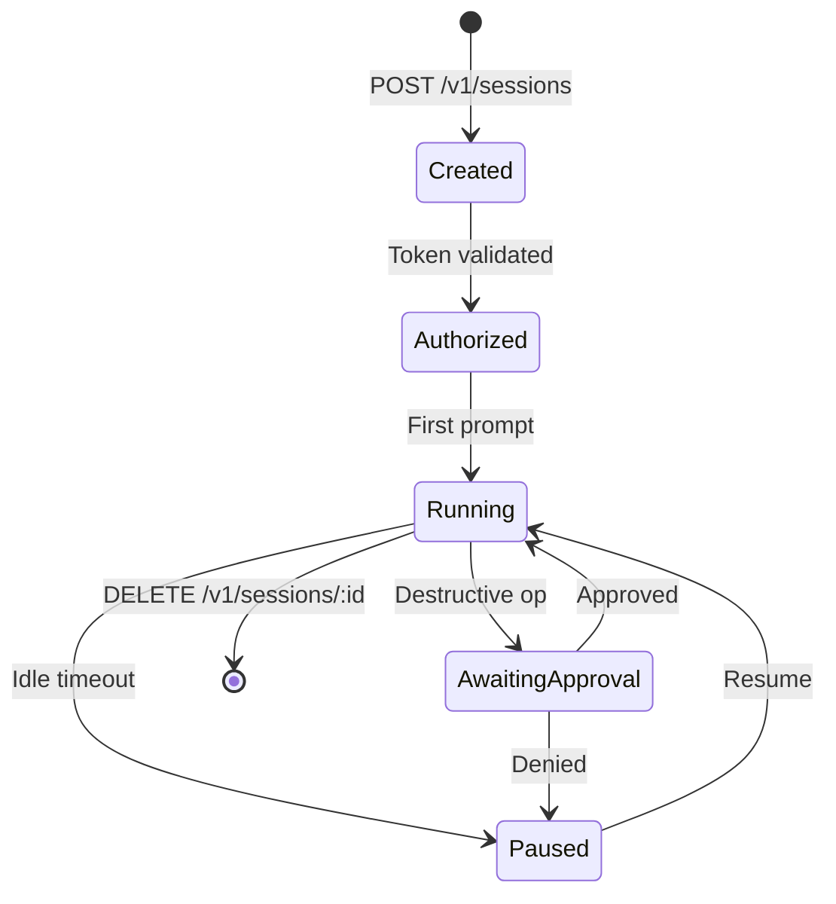

---
title: Agentic System Administration
description: Why Tribunus treats agents as managed processes, not chat prompts with tools
date: 2026-06-19
tags: [Philosophy, Architecture, Coordination]
---

## The Wrong Abstraction

AI coding tools are chat windows with tool access. Each window has its own context, its own model temperature, its own accumulated token history. An operator running five Claude Code windows has five independent agent instances with no coordination, no shared state, and no unified permission model.

This works fine when one person drives one agent. It breaks immediately when you scale to multi-agent workflows — parallel tool invocations, shared state stores, interdependent session lifecycles, crash recovery, rate limiting across agents.

The root problem is abstraction: treating the agent as a chat session with ad-hoc tool privileges confuses the interface with the runtime. A chat window is a user interface, not a process model. When your "agent system" is N terminal tabs each running their own interpreter, you have no:

- Centralized session management (no way to list active agents, pause them, or terminate them from a single point)
- Shared capability model (every window inherits the user's full terminal authority)
- State persistence across crashes (lose the window, lose the agent's entire working memory)
- Execution verification (no receipts — the agent asserts what it did, the system never proves it)
- Backend routing (each window is pinned to whatever model provider its config file specifies)

## What Tribunus Does Differently

Tribunus treats agents as managed processes with explicit lifecycles, scoped authority, and receipt-verified execution. An agent is not a chat window — it is a session object with a state machine, a capability manifest, a durable backing store, and an inference routing layer that picks the right hardware backend per-operation.

### Centralized Session Management

Every agent has an explicit lifecycle:

```
POST /v1/sessions          → create a new agent session
Authorization: Bearer sk-… → token validated → agent enters Created state
First prompt dispatch      → agent transitions to Running
Idle timeout                → agent transitions to Paused (state serialized to Valkey)
Destructive operation       → agent blocks in AwaitingApproval
Approval granted            → agent resumes Running
DELETE /v1/sessions/:id     → agent terminates, state flushed to PGlite
```

The session is not an ephemeral context window — it is a persisted state machine that survives process restart, network partition, and hardware backend swaps.

### Capability Boundaries

Every agent operates within a capability manifest. The manifest is set at session creation and is not extensible at runtime. Compare with the ambient authority model:

```rust
/// Middleware: require a valid Bearer token for /v1/* routes.
/// Returns 401 UNAUTHORIZED when the token is missing or invalid.
async fn auth_middleware(
    State(state): State<AppState>,
    req: Request,
    next: Next,
) -> Result<impl IntoResponse, StatusCode> {
    let auth = req
        .headers()
        .get("Authorization")
        .and_then(|v| v.to_str().ok())
        .unwrap_or("");

    if !auth.starts_with("Bearer ") {
        return Err(StatusCode::UNAUTHORIZED);
    }

    let token = &auth[7..];
    if !state.auth.validate(token) {
        return Err(StatusCode::UNAUTHORIZED);
    }

    Ok(next.run(req).await)
}
```

Every API request is authenticated by Bearer token, not by ambient machine login. Rate limiting uses per-IP token buckets with atomic CAS operations:

```rust
pub fn try_consume(&self, tokens: u64) -> bool {
    self.refill();
    loop {
        let current = self.tokens.load(Ordering::Acquire);
        if current < tokens {
            return false;
        }
        match self.tokens.compare_exchange(
            current,
            current - tokens,
            Ordering::Release,
            Ordering::Acquire,
        ) {
            Ok(_) => return true,
            Err(_) => continue,
        }
    }
}
```

### State Persistence Across Restarts

State is not in the context window — it is in backed stores with different durability guarantees:

- **Valkey** for ephemeral coordination: cache entries, session tokens, lock leases, the current working set of the agent's world model
- **PGlite** for durable authority: agent missions, receipts, entity records, plan history
- **DuckDB** for analytical projection: queries against streaming data, periodic snapshots from PGlite

```rust
// Valkey adapter — ephemeral coordination state
#[async_trait]
impl CoordinationPort for ValkeyAdapter {
    async fn get_work(&self, work_id: &str) -> Result<Option<CoordinationWorkRecord>> {
        let mut conn = self.client.get_multiplexed_tokio_connection().await?;
        let key = format!("work:{}", work_id);
        let exists: bool = conn.exists(&key).await?;
        if !exists {
            return Ok(None);
        }
        let state: String = conn.hget(&key, "state").await?;
        let acked: bool = conn.hget(&key, "acked").await?;
        Ok(Some(CoordinationWorkRecord { work_id: work_id.into(), state, acked }))
    }
}

// PGlite adapter — durable receipt authority
#[async_trait]
impl DurableAuthorityPort for PgAdapter {
    async fn commit_receipt(&self, record: DurableReceiptRecord) -> Result<()> {
        self.client.execute(
            "INSERT INTO durable_receipts (receipt_id, work_id, timestamp) VALUES ($1, $2, $3)",
            &[&record.receipt_id, &record.work_id, &record.timestamp as &dyn ToSql],
        ).await?;
        Ok(())
    }
}
```

### Receipt-Based Execution Verification

Every agent mutation produces a cryptographic receipt — a structured record of what state was before, what state was after, and what operation transformed one into the other. Receipts are not optional logging. They are the mechanism by which the agent's world model is updated with ground truth. An agent that cannot produce receipts for its actions cannot distinguish between executing a plan and imagining one.

### Backend-Agnostic Inference Routing

An agent is not pinned to a single model provider. Tribunus's FlexDispatch system routes each operation to the best available hardware backend based on real-time system state:

```rust
pub enum ThermalState {
    Nominal,
    Fair,
    Serious,
    Critical,
}

pub struct SystemState {
    pub gpu_utilization: f64,
    pub ane_utilization: f64,
    pub cpu_utilization: f64,
    pub gpu_memory_fraction: f64,
    pub thermal_state: ThermalState,
    pub battery_remaining: f64,
}
```

MatMul operations route to MLX (GPU) under nominal conditions, fall back to ANE when thermal or battery constraints demand efficiency. Attention operations route to ANE when GPU is saturated, Accelerate when CPU is the only available path. Element-wise ops route to Accelerate (NEON) to keep GPU free for the heavy work. The agent never sees the dispatch decision — it is part of the compiled compute image.

## The Agent Lifecycle



The agent lifecycle is not a convention — it is enforced by the session state machine:

```rust
pub enum ControlSessionState {
    Created,
    Admitted,
    Submitted,
    PrefillReady,
    PrefillRunning,
    Decoding,
    Completed,
    Cancelled,
    Failed,
}

impl ControlSessionState {
    pub fn can_transition_to(&self, next: Self) -> bool {
        use ControlSessionState::*;
        if *self == next { return true; }
        if self.is_terminal() { return false; }
        match (*self, next) {
            (Created, Admitted)
            | (Admitted, Submitted)
            | (Submitted, PrefillRunning)
            | (PrefillRunning, Decoding)
            | (Decoding, Completed) => true,
            (Decoding, Cancelled) | (_, Failed) => true,
            _ => false,
        }
    }
}
```

Every transition is validated. Invalid transitions (e.g., jumping from Created directly to Completed) are rejected at the type level before any code executes. There is no "just set a field to running" — the state machine owns the lifecycle.

## Capability Boundaries in Practice

The Admin API exposes the full capability boundary model. Every endpoint is protected by X-Admin-Key authentication:

```rust
pub fn admin_router() -> Router<AppState> {
    Router::new()
        .route("/v1/admin/status", get(admin_status))
        .route("/v1/admin/sessions", get(admin_sessions))
        .route("/v1/admin/cancel/{id}", post(admin_cancel))
        .route("/v1/admin/reload", post(admin_reload))
        .route("/v1/admin/evolkv", post(admin_evolkv))
        .route_layer(middleware::from_fn(admin_auth))
}
```

### GET /v1/admin/status

Returns a full system state dump: hardware config, loaded models, active session phase, telemetry counters (tokens generated, cache hit rates, backend invocation counts per engine), memory pressure, and EXO cluster status.

```rust
async fn admin_status(State(state): State<AppState>) -> JsonResponse<serde_json::Value> {
    let response = json!({
        "status": "ok",
        "hardware": {
            "chip": chip,
            "ram_mb": ram_mb,
        },
        "models": { "entries": model_list, "count": model_list.len() },
        "model_cache": cache_info,
        "session": sess_info,
        "telemetry": telemetry_info,
        "exo": exo_info,
        "rate_limiter": rl_info,
    });
    JsonResponse(response)
}
```

### POST /v1/admin/cancel/:id

Places a cancellation signal that running request handlers check on the next iteration boundary. The session transitions to Cancelled at the next safe point — no forced thread kill, no torn state.

### GET /v1/admin/sessions

Lists every active request with its ID, status, tokens generated, model, and elapsed time. The engine session phase (prefill, decode, idle) is reported alongside.

### POST /v1/admin/reload

Hot-reloads model segments from the filesystem, processing pending changes and re-scanning model image directories. The cache remains consistent — reloads are atomic at the manifest level.

### POST /v1/admin/evolkv

Triggers an evolutionary search over KV cache budget allocation. Accepts an optional `model` parameter, runs a genetic algorithm over per-layer cache budgets, and returns the optimal allocation:

```rust
let evolkv = EvolKV {
    num_layers,
    population_size: 60,
    generations: 30,
    mutation_rate: 0.15,
    crossover_rate: 0.7,
    elitism_count: 3,
};
let result = evolkv.search(&calibration, total_budget);
```

## Comparison: Claude Code Window vs Tribunus Agent Session

| Aspect | Claude Code Window | Tribunus Agent Session |
|---|---|---|
| **State** | Ephemeral, in-context | Persistent, Valkey + PGlite |
| **Auth** | Machine login | Bearer token per request |
| **Capabilities** | Ambient (full terminal access) | Scoped by manifest |
| **Approval** | None | Per-operation levels (read/ask/write/exec) |
| **Recovery** | Lost on crash | State machines with receipts |
| **Backend** | Single model provider | FlexDispatch to GPU / ANE / CPU |
| **Multi-agent** | Manual coordination across windows | Centralized session management |
| **Lifecycle** | Process attached | State machine with explicit transitions |
| **Rate limiting** | None | Per-IP token bucket |
| **Observability** | None built in | Telemetry counters, admin API, structured logging |
| **Cache** | None | TurboQuant KV cache + shared prefix cache |
| **Execution proof** | Agent says what it did | Receipts verify what happened |

## Why This Matters

Without agent system administration, multi-agent systems devolve into chaos. Each agent operates in its own silo with ambient authority, no coordination, and no accountability. Crashes lose state. Rate spikes overwhelm shared infrastructure. Operators have no dashboard, no API, no way to answer "what is my system doing right now?"

Tribunus's contribution is treating agent orchestration as a **systems problem** — processes, permissions, state, and observability — not a prompt engineering problem.

The state machine is not a suggestion. The capability manifest is not a convention. The receipt chain is not optional logging. These are the same abstractions that operating systems have used for decades to manage processes, and they apply directly to agents:

- **Process isolation**: Each agent session has its own state, its own capability grant, its own lifecycle. One agent cannot inspect another agent's state without explicit authorization.
- **Capability-based security**: The agent declares what it needs in its manifest at creation time. The runtime gates every operation against that manifest. No ambient authority.
- **Observability**: Every mutation produces a receipt. Every request is tracked in the registry. Every telemetry counter is accessible through the admin API. The system never says "I don't know what happened."
- **Resource management**: Rate limiting, body size limits, request timeouts, cache budgets — all enforced at the middleware layer, not left to agents to self-regulate.

The design is not new. It is the same architecture that made Unix processes composable, that made web servers manageable, that made distributed systems observable. The insight is applying these proven systems abstractions to a domain that has been treating agents as ephemeral chat conversations.

Agents are processes. Manage them like it.
