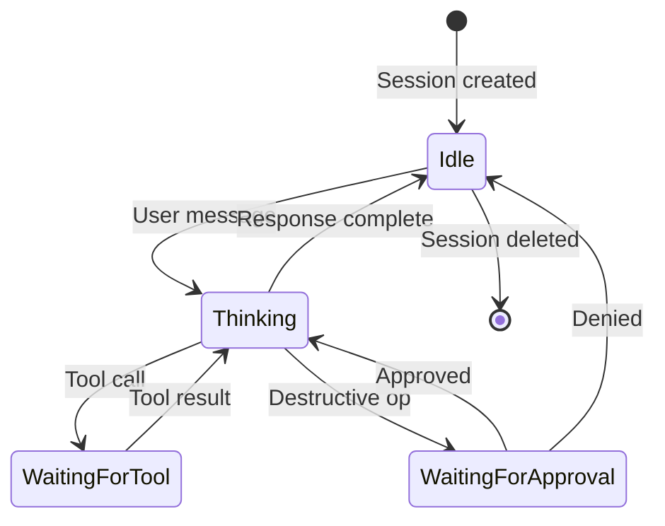

Most agent frameworks treat an agent as a prompt that calls tools: send a system prompt into a language model, get back text, parse tool calls, loop. This works for one agent. It falls apart at two, and it is a catastrophe at ten.

Tribunus takes a different approach. An agent is not a prompt — it is a **state machine with explicit transitions**. Thinking, tool execution, approval gates, and recovery are first-class states in a runtime that manages loops, not text. Prompt engineering is something you do to a particular transition. The operator designs the state machine.

## The Scaling Ceiling of Prompt Engineering

Every prompt-based agent system hits the same wall. You can make a single agent work well by tuning its system prompt — adding examples, tightening constraints, adjusting tone. But that prompt is a monolith: it encodes goals, tool descriptions, interaction protocols, fallback behavior, and personality all in one unstructured string.

When you add a second agent, you need coordination protocols embedded in both prompts. A third agent needs shared state — also embedded in prompts. By the tenth agent, you need a scheduler, a conflict resolver, a retry policy — all of which must be expressed as instructions to a language model that may or may not follow them.

Prompt engineering **does not compose**. The coordination logic, state tracking, and policy enforcement are implicit in the text rather than explicit in the runtime. State machines do compose, because the runtime owns the transitions and the prompt only owns the content of each step.

## The Session State Machine

Tribunus agents are finite state machines with explicit, enforced transitions:



This is not an implementation detail — it is the programming model. Every transition is a hook where policy can be injected:

- **Idle → Thinking**: rate limiter check, admission control
- **Thinking → WaitingForTool**: capability gate, receipt recording
- **Thinking → WaitingForApproval**: destructive-operation detection, approval-routing
- **WaitingForApproval → Thinking**: policy evaluation, receipt sealing
- **Every transition**: receipt chain append, telemetry emit

The underlying inference session has its own state machine, visible to the operator:

```rust
/// Host-side session state machine.
#[derive(Clone, Copy, Debug, PartialEq, Eq)]
pub enum ControlSessionState {
    /// Session created, pending admission.
    Created,
    /// Session admitted by the engine, awaiting worker submission.
    Admitted,
    /// Session submitted to worker, pending prefill execution.
    Submitted,
    /// Prefill input is available and ready to start.
    PrefillReady,
    /// Prefill is actively running.
    PrefillRunning,
    /// Autoregressive decoding loop is running.
    Decoding,
    /// Generation completed normally (EOS or max_tokens reached).
    Completed,
    /// Generation was externally cancelled.
    Cancelled,
    /// Generation failed with an error.
    Failed,
}

impl ControlSessionState {
    pub fn can_transition_to(&self, next: Self) -> bool {
        use ControlSessionState::*;

        if *self == next {
            return true;
        }
        if self.is_terminal() {
            return false;
        }

        match (*self, next) {
            (Created, Admitted)
            | (Admitted, Submitted)
            | (Submitted, PrefillRunning)
            | (PrefillRunning, Decoding)
            | (Decoding, Completed) => true,
            (Decoding, Cancelled)
            | (PrefillReady, Cancelled)
            | (PrefillRunning, Cancelled) => true,
            (PrefillReady, PrefillRunning) => true,
            (_, Failed) => true,
            _ => false,
        }
    }
}
```

Every transition is validated at runtime. An invalid transition produces an error rather than silently continuing in an inconsistent state. This is the same discipline database transactions follow — and for the same reason.

### A Worked Example

When a user sends a message:

1. The runtime creates a session (state: `Created`), admits it (`Admitted`), and submits it to a worker (`Submitted`).
2. The worker begins prefill (`PrefillRunning`), transitions to autoregressive decoding (`Decoding`).
3. During decoding, the model produces a tool call. The runtime transitions the agent session to `WaitingForTool`, the tool executes, and the result feeds back into decoding (`Thinking`, which maps to the inference `Decoding` state).
4. If the tool call is destructive (file write, network mutation), the session transitions to `WaitingForApproval` instead. The runtime blocks until a human approves or denies the action.
5. On completion or cancellation, the session moves to a terminal state: `Completed`, `Cancelled`, or `Failed`.

The operator sees the session lifecycle as a directed graph, not a conversation log.

## Scoped Authority

Capability checks map directly to state transitions. When an agent attempts a tool call, the runtime checks whether the current state permits that capability level:

```rust
pub enum ApprovalLevel {
    /// Read-only operations allowed in Thinking state.
    Read,
    /// Write operations require explicit session scope.
    Write,
    /// Exec operations always require user approval.
    Exec,
}

fn check_capability(
    state: &ControlSessionState,
    level: ApprovalLevel,
    session_scope: &SessionScope,
) -> Result<()> {
    match level {
        ApprovalLevel::Read => {
            // Read is allowed in Thinking (decoding) state.
            ensure!(
                matches!(state, ControlSessionState::Decoding),
                "read operations require Decoding state"
            );
            Ok(())
        }
        ApprovalLevel::Write => {
            // Write requires either a read-write session scope
            // or explicit approval escalation.
            if session_scope.allow_writes {
                return Ok(());
            }
            Err("write operations require WaitingForApproval".into())
        }
        ApprovalLevel::Exec => {
            // Exec always requires explicit human approval.
            Err("exec operations always require approval".into())
        }
    }
}
```

This is a **policy gate**, not a suggestion. A prompt-based system asks the model to "only use tools that are safe" — a state machine system enforces it at the runtime boundary. The model cannot escalate its own authority because the state transition table is compiled into the runtime, not inferred from natural language.

The same mechanism enables scoped delegation: a session started with `read` scope never enters `WaitingForApproval` because write operations fail before the model sees the tool. The operator chooses the capability envelope at session creation time; the runtime enforces it for the session's entire lifetime.

## Receipt-Based Recovery

When an agent session crashes or is interrupted, a prompt-based system loses state. The conversation is gone, the tool results are lost, and the agent either restarts from scratch or — worse — continues with incomplete context.

In Tribunus, every transition produces a **receipt**. The receipt chain is an append-only log recording every state transition, every tool call, every generation, and every policy decision:

```rust
#[derive(Debug, Clone)]
pub struct SessionReceipt {
    pub session_id: SessionId,
    pub model_id: ModelRuntimeId,
    pub reserved_kv_bytes: u64,
    pub created_at: SystemTime,
}

#[derive(Debug, Clone)]
pub struct PrefillReceipt {
    pub session_id: SessionId,
    pub tokens_consumed: u32,
    pub kv_entries_created: u32,
}

#[derive(Debug, Clone)]
pub struct CancellationReceipt {
    pub request_id: RequestId,
    pub session_id: SessionId,
    pub received_at: SystemTime,
}
```

When an agent session crashes:

1. A supervisor detects the timeout or error.
2. The recovery coordinator reads the receipt chain from the last verified checkpoint.
3. The session is reconstructed to the last confirmed state — including partial tool results and partial generations.
4. Recovery resumes from the reconstructed state, not from scratch.

The receipts are not debugging metadata. They are the **source of truth** for session state. The runtime does not reconstruct state by re-running the model — it reconstructs state by replaying the receipt chain. This means recovery is deterministic and O(receipts) rather than O(generations).

Receipts also serve as an audit trail. Every action an agent took is recorded with its preconditions (the state before the transition) and its postconditions (the state after). This is essential for regulated environments where every agent action must be explainable and verifiable.

## Connection to JEPA / World Models

This architecture maps directly to Yann LeCun's Joint Embedding Predictive Architecture (JEPA) paper, where agency is decomposed into separate modules:

- The **world model** is the session state — what has happened, what is currently true about the environment. The receipt chain is the world model's training data.
- The **ego model** is the agent's reasoning — what to do next given the current state. Each Thinking/Decoding phase runs the ego model against the world model.
- The state **transitions** are the JEPA latent space. The system does not predict tokens — it predicts state changes. Tokens (text, tool calls) are the observable manifestation of those underlying state transitions, not the primary output.

In JEPA terms, the operator designs the architecture of the latent space (the state machine), not the content of the representations. The content is produced by the model at runtime. This is the same separation that makes modern compilers work: the operator writes the control flow graph, the code generator fills in the instructions.

The prompt-based approach conflates these: the latent space and the content are both in the same unstructured string. The state-machine approach separates them, and that separation is what enables composition, verification, and recovery.

## Why This is Harder But Better

The prompt-based approach is easier to prototype. Fire up a notebook, write a system prompt, call an API, get results in minutes. No session manager, no policy engine, no receipt store, no recovery coordinator.

This is also why it fails at scale.

Building a state-machine agent runtime requires:

- A **session manager** that owns state transitions and enforces the transition table.
- A **policy engine** that evaluates capability requests against session scope and approval levels.
- A **receipt store** that records every transition in an append-only log.
- A **recovery coordinator** that reconstructs session state from receipts after failure.
- A **supervisor** that detects stalled or crashed sessions and triggers recovery.

None of this is trivial. But the payoff is deterministic behavior, compositional guarantees, and audit trails that satisfy regulatory requirements.

| Property | Prompt-Based Agent | State-Machine Agent |
|---|---|---|
| **State management** | Implicit in conversation history | Explicit in receipt chain |
| **Authority enforcement** | Model's discretion | Runtime policy gate |
| **Failure recovery** | Restart from scratch | Deterministic replay |
| **Composition** | Embedded in prompts | First-class transitions |
| **Audit trail** | None (transient) | Append-only receipts |
| **Scaling** | O(n²) coordination | O(n) policy checks |

The prompt-based approach is a prototype's best friend and a production system's worst enemy. The state-machine approach is the opposite: it requires more upfront architecture, but it is the only way to operate agents at scale with deterministic behavior and verifiable audit trails.

This is the same tradeoff that every engineering discipline makes — the transition from scripts to services, from monoliths to microservices, from ad-hoc to structured. Agent engineering is no different.
