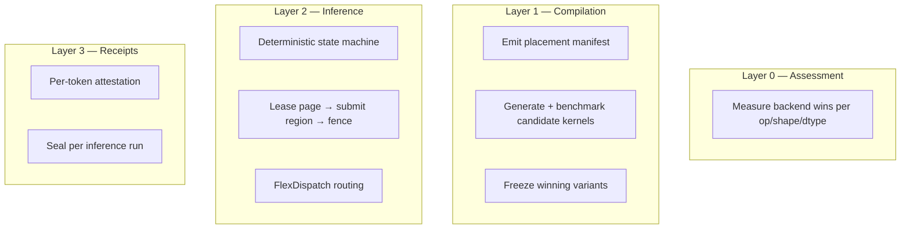

## Prologue -- The Thread

Tribunus is not one thing. That is the first fact any serious analysis must confront. It is an inference engine that compiles model graphs into frozen golden paths. It is an agent runtime that executes long-running, recoverable missions over mutable world state. It is a plugin system with capability-scoped sandboxes. It is a security model where every authority must be explicitly granted and every mutation must be receipted. And the tension between these identities is not an accident of scope creep -- it is the point.

The core thesis is this: these layers must be compiled together, not assembled at runtime. An agent framework that calls out to an inference server over HTTP is not an integrated system -- it is two systems that happen to be in the same building. A runtime that grafts plugin support on after the fact cannot audit what plugins do. A memory manager that treats the KV cache as a black box cannot make optimal scheduling decisions.

Tribunus compiles the entire stack from a single canonical representation: the compute image. The compute image is not just a serialized model. It encodes the plan -- which hardware backend runs each operation, where tensor memory lives, how the KV cache is compressed, what the agent's state transitions are, and what receipts must be produced before a mutation is considered committed. Everything else -- the agent loop, the plugin dispatcher, the network fabric -- exists to execute the plan, not to improvise one at runtime.

This essay traces the intellectual architecture that leads to that conclusion, paper by paper, constraint by constraint.

---

## World Models and the Agent Runtime

> "An agent that can predict the consequences of its actions, and that can reason about the consequences of sequences of actions it might take, can plan." -- Yann LeCun, *A Path Towards Autonomous Machine Intelligence*

LeCun's 2022 position paper is the single most important reference for the agent side of Tribunus. It lays out an architecture for autonomous intelligence that maps almost exactly onto the Tribunus agent runtime, even though it was written entirely in the language of cognitive science rather than systems engineering.

The key concepts from the paper that structure Tribunus's agent design:

### World Models and Amortized Inference

A world model predicts the next state of the environment given the current state and an action. LeCun distinguishes between predicting in latent space (which is cheap) and predicting in observation space (which is expensive). Tribunus agents maintain a world-state memory that is always latent -- a structured, typed representation of the entities, relationships, and pending operations the agent knows about. The agent does not re-prompt the LLM to reconstruct the world state every cycle. It reads from the latent state and only invokes the inference engine when it needs to project a new course of action.

### Hierarchical Planning over Multiple Timescales

The paper describes a hierarchical architecture where a slow, abstract planner proposes subgoals and a fast, concrete executor fulfills them. Tribunus implements this as a stack:

1.  **Mission level**: A mission descriptor defines the agent's objective, constraints, and success criteria. This rarely changes.
2.  **Plan level**: A sequence of plan steps, each with a precondition, an action specification, and expected effects. The plan is computed once and then executed step by step.
3.  **Step level**: Each plan step maps to one or more tool calls, inference invocations, or state mutations. The step executor can retry, roll back, or escalate.

This is not a chat loop. The agent does not regenerate the entire plan on every turn. It only re-plans when a step's postcondition does not match the observed world state.

### Intrinsic Motivation and Model Predictive Control

> "An agent equipped with a world model can engage in *intrinsic motivation*: seeking out states that increase the information content of the model itself."

LeCun's formulation of intrinsic motivation as uncertainty reduction maps directly to Tribunus's receipt system. When an agent executes a mutation (writes to the KV store, inserts a row in PGlite, calls an external API), the runtime produces a receipt -- a cryptographically bound record of what happened, when, and what the world state was before and after.

```rust
// Every execution produces a receipt with per-backend provenance
#[derive(Debug, Clone, Serialize, Deserialize)]
pub struct BackendVersionInfo {
    pub mlx_version: Option<String>,
    pub coreml_xcode_version: Option<String>,
    pub coreml_compiler_version: Option<String>,
    pub accelerate_sdk_version: Option<String>,
    pub mlx_diagnostic: Option<String>,
    pub coreml_diagnostic: Option<String>,
    pub accelerate_diagnostic: Option<String>,
}
```

The receipt records not just which backend ran, but which version of that backend observed the execution. This is critical for evidence discipline: a receipt that says "MLX executed this GEMM" is useless without knowing which MLX version, on which macOS, with which Metal compiler.
 Receipts are not optional logging. They are the mechanism by which the agent's world model is updated with ground truth. An agent that cannot produce receipts for its actions cannot distinguish between "I changed the world" and "I was told the world changed."

### JEPA-Style Latent Prediction

The Joint Embedding Predictive Architecture (JEPA) operates in latent space rather than observation space. Tribunus makes the same choice for its agent memory: the world-state memory is a structured key-value store (backed by Valkey for ephemeral state and PGlite for durable state), not an LLM context window. The agent reads from and writes to this structured memory. The inference engine (the LLM) only enters the critical path when the agent needs to project a future state or reason about a branch point.

### Separation of World Model and Actor

LeCun separates the *world model* (predicts state transitions) from the *actor* (produces actions given a goal). Tribunus separates the *inference engine* (which encodes and decodes the latent world state through the LLM) from the *executor* (which carries out tool calls and state mutations). The two communicate through the plan and the receipt chain. They do not share a single prompt.

---

## Inference Is Memory Orchestration

> "PagedAttention manages the KV cache in fixed-size blocks (pages), eliminating internal fragmentation and enabling on-demand allocation." -- Kwon et al., *Efficient Memory Management for Large Language Model Serving with PagedAttention*

The vLLM paper, published at SOSP 2023, reframed inference serving as a memory-management problem. Before PagedAttention, the KV cache was a contiguous allocation equal to the model's maximum sequence length times batch size. This was wildly inefficient for variable-length requests, which are the norm in real-world serving.

vLLM's insight was straightforward: treat KV cache pages the way operating systems treat virtual memory pages. Allocate them on demand, share them across requests that share prefixes (parallel sampling, beam search), and evict them under memory pressure. The throughput gains were dramatic -- 2-4x over prior systems -- because the bottleneck was never GPU compute. It was always GPU memory.

### Current Benchmarks (Qwen2.5 0.5B, M1 Max)

| Phase | tok/s | What it means |
|-------|-------|---------------|
| Current baseline | 65 | Custom MLX-heavy runtime with heterogeneous scaffolding |
| Arena/residency | 100-160 | Zero-copy arena, paged residency, fused backend regions |
| Speculation active | 180-280 | Speculative decode with ANE draft, GPU verifier |
| Full stack | 300+ | Draft model, verifier batching, Core ML region fusion, KV transactions |

These are measured on M1 Max (64GB) with Qwen2.5 0.5B NF4 quantized. The 65 tok/s baseline is the current shipping mode. Each tier above it corresponds to a compile-time optimizer pass that is implemented and passing tests but not yet gated into production.


Tribunus takes this lesson and pushes it further:

### TurboQuant KV Cache Compression

The KV cache is the dominant memory cost at inference time. For a 70B parameter model with a 32K context, the KV cache alone can exceed 80 GB at FP16. Tribunus compresses the KV cache using quantization-aware techniques (TurboQuant) that reduce per-token KV memory by 4-8x while preserving generation quality. This is not a separate optimization -- it is wired into the compute image compiler so that the cache layout is known at plan-compile time, not discovered at runtime.

```rust
// TurboQuant — in-flight KV cache compression state
pub struct TurboQuantState {
    pub keys: Vec<u8>,           // Quantized key tensor (byte-aligned)
    pub values: Vec<u8>,         // Quantized value tensor
    pub num_tokens: usize,       // Tokens stored in this slot
    pub bits: u32,               // Target bit width (2-8)
    pub head_dim: usize,         // Head dimension for dequant
    pub k_bits: u32,             // Key bit width (may differ from values)
    pub v_bits: u32,             // Value bit width
    pub qjl_keys: Vec<u8>,       // QJL error correction bits (TurboQuant3 mode)
    pub qjl_values: Vec<u8>,     // QJL error correction for values
}
```

This struct is the per-slot state for the quantized KV cache. Each cache slot carries its own quantization parameters, allowing per-layer and even per-head quantization budgets. The QJL error correction fields enable 2.5-bit effective compression with sub-1% quality degradation on GSM8K.


### Decode/Prefill Phase Separation

The prefill phase (computing the initial KV cache from the prompt) has fundamentally different compute and memory characteristics than the decode phase (generating one token at a time). Prefill is compute-bound and benefits from large batches. Decode is memory-bound and benefits from small, latency-optimized batches. Tribunus separates these phases at the scheduler level, routing prefill work to different hardware lanes (ANE for amortized prefill, GPU for burst decode, CPU for fallback).

### Cache-Aware Routing

When a request arrives, the compute image already knows the cache topology: which layers are quantized, which blocks are pinned to which memory island, which prefixes are hot in the shared prefix cache. The scheduler routes to the worker that can reuse the most existing cache state. This is not possible in a system that discovers cache state at runtime.

Tribunus is not a wrapper around llama.cpp or MLX. It is becoming a serious inference engine in its own right, built from the memory-first principles that the vLLM paper established.

---

## The Compute Image Compiler

> "MLIR is a compiler infrastructure that enables the construction of domain-specific compilers within a shared, extensible framework." -- Lattner et al., *MLIR: A Compiler Infrastructure for the End of Moore's Law*

The MLIR paper, presented at CGO 2021, describes a compiler architecture built for heterogeneity. Before MLIR, building a new compiler meant either (a) writing the entire stack from dialect to codegen, or (b) contorting the problem to fit into LLVM IR, which was designed for CPU code, not tensor graphs, not dataflow pipelines, not heterogeneous hardware.

MLIR solved this by making the IR composable. Dialects live side by side. Transform passes operate on a mix of dialects. Lowering is progressive: high-level tensor ops become memory ops become target-specific intrinsics. The same infrastructure serves a neural network compiler, a digital signal processor compiler, and an FPGA compiler.

Tribunus's compute image compiler is not an MLIR dialect. But it is MLIR's architecture applied to the Tribunus problem:




### PhaseIR

The compiler's internal representation (PhaseIR) is a dialect-neutral graph of operations on tensors and control flow. It is not tied to any specific backend's graph format. A model that enters the compiler as an MLX graph (captured via the MLX Python or Rust API) is lifted into PhaseIR. A model that enters as a Core ML model is lifted into PhaseIR. The compiler then applies optimization passes that are PhaseIR-native: fusion, quantization planning, memory layout, phase qualification.

### The Compute Image Pipeline

1.  **Capture**: The model graph is captured from a frontend (MLX, Core ML, ONNX).
2.  **Lift**: The graph is lifted into PhaseIR, normalizing away frontend-specific idiosyncrasies.
3.  **Qualify**: Each operation is qualified against the available backends. Can this GEMM run on the ANE? Does this attention pattern have a Metal kernel? The result is a *phase-qualified plan* where every node is tagged with one or more valid backends.
4.  **Optimize**: Backend-agnostic passes (fusion, dead-code elimination, constant folding) run first. Then backend-specific passes (cache tiling, quantization insertion, memory island assignment).
5.  **Lower**: Each backend's subgraph is lowered to its native format. MLX ops become mlx\_core calls. Core ML ops become MIL program operations. Metal ops become MSL source.
6.  **Freeze**: The lowered subgraphs, memory layout, and cache plan are serialized into a compute image. The compute image is the frozen golden path. It is not re-compiled at load time.

### Avoiding the MLX-as-Universal-Compiler Mistake

MLX is an excellent array framework and a usable frontend. It is not a compiler. Using MLX's graph capture as the sole IR for a heterogeneous backend would be the same mistake as using LLVM IR for everything before MLIR existed. MLX's graph is MLX-shaped. It does not express Core ML MIL operations, Metal threadgroup memory layouts, or Accelerate BNNS graph nodes. The compute image compiler lifts MLX graphs into PhaseIR and then lowers them to the right backend, rather than trying to make MLX do everything.

### Backend-Agnostic Compilation

The golden path is not backend-specific. The same PhaseIR plan can produce a compute image for ANE-only deployment, GPU-only deployment, or heterogeneous deployment. The difference is in the lowering pass, not in the plan. This is what makes Tribunus a compiler, not a wrapper.

---

## Distributed Inference and Federation

> Dynamo: "An open-source, low-latency, modular inference system for distributed AI serving." -- NVIDIA Dynamo (2025)

NVIDIA's Dynamo project (open-sourced in 2025) is the closest industry parallel to Tribunus's distributed inference architecture. Dynamo treats inference serving as a distributed systems problem: request routing, load-aware scheduling, prefix caching across nodes, dynamic batching, and fault tolerance.

Tribunus's dharma model takes this further. Dharma is a mutual-aid inference fabric where participating nodes contribute compute capacity and draw from the pool as needed. The architecture is:

- Each node runs a local infererence stack (MLX, Core ML, Metal).
- Nodes advertise their capabilities (model availability, backend types, current load) through a capability-discovery protocol.
- When a node receives a request it cannot serve (wrong model, wrong backend, insufficient memory), it routes the request to a peer that can serve it.
- The routing decision is informed by the same phase-qualified plan that drives local execution. The planner knows which backends are needed and which peers have them.

This is not distributed inference in the traditional sense (split a model across nodes). It is federated inference: each node serves the entire model on its own hardware, and the federation handles overflow, failover, and capability mismatch.

---

## The Local-First Cell

> "Local-first software operates on local data, synchronizes through CRDT-based replication, and works offline by design." -- Kleppmann et al., *Local-First Software*

The local-first movement, embodied by projects like ElectricSQL/PGlite, PowerSync, Replicache, RxDB, Automerge, Yjs, and Jazz, established a clear architecture: the client is the authority for its own data, synchronization is eventual and conflict-free, and offline operation is not an afterthought but a design requirement.

Tribunus's Cell model applies this at the agent runtime level:

### PGlite as Durable Local Authority

Every Tribunus cell runs an embedded PGlite instance. This is the durable authority for the cell's state. Agent missions, receipts, entity records, and plan history live in Postgres-compatible tables. The cell never waits for a network round trip to commit its state.

### Valkey as Ephemeral Coordination

Valkey (a Redis-compatible key-value store) holds the ephemeral state: cache entries, session tokens, lock leases, and the current working set of the agent's world model. Valkey is not durable. If Valkey restarts, the ephemeral state is reconstructed from PGlite.

### DuckDB as Projection/Analytics

DuckDB provides the analytical projection layer. The agent runs SQL queries against DuckDB tables that are periodically refreshed from PGlite or from streaming data. This is separate from the operational state in PGlite -- analytics workloads do not compete with transaction workloads.

### Federation Envelopes

Cells synchronize through federation envelopes -- typed, serialized packets of state diffs that flow between cells through the dharma fabric. The envelope format includes a schema version, a capability signature, and optional receipts. Cells that receive an envelope apply the diff to their local PGlite and update their DuckDB projections.

The cell is the unit of deployment, the unit of failure isolation, and the unit of trust. Two cells in the same federation do not share memory or processes. They share envelopes.

---

## Capability Boundaries and Plugin Governance

> "A capability is an unforgeable token that confers the authority to perform a specific operation." -- Mark Miller, *Robust Composition: Towards a Unified Approach to Access Control and Transaction Control*

The browser extension security model is the most widely deployed capability system. An extension declares what it needs in a manifest (permissions for tabs, storage, web requests), the browser gates each operation, and the extension runs in a sandboxed process with no ambient authority.

Tribunus extends this model to agent plugins:

### Capability-Scoped Plugins

Every plugin declares a manifest listing the capabilities it requires:
- Which inference backends it can access.
- Which state stores (PGlite tables, Valkey keyspaces) it can read or write.
- Which external APIs it can call.
- Which tool definitions it can register.

The capability set is not extensible at runtime. A plugin cannot request access to a state store that was not in its manifest, and the manifest is verified at install time and pinned in the compute image.

### Approval Levels

Not all capabilities have the same risk profile. Tribunus defines three approval levels:

| Level | Scope | Example |
|-------|-------|---------|
| Automatic | Safe, well-understood operations | Reading a known table, calling a documentation tool |
| User confirm | Operations with side effects | Writing to external state, calling an external API |
| Admin approve | Destructive or privilege-escalating operations | Installing new plugins, modifying capability boundaries |

### Mutation Classes

Every mutation carries a class tag: `STATE_READ`, `STATE_WRITE`, `EXTERNAL_CALL`, `PLUGIN_INSTALL`, `CAPABILITY_ESCALATE`. The scheduler uses the class tag to decide whether a receipt is required, whether user confirmation is needed, and whether the operation should be batched or serialized.

### Surface Separation

Web, PWA, and mobile surfaces do not inherit desktop or runtime authority. A plugin that can read the entire PGlite database when running in the desktop runtime cannot do so when running in the web surface. The capability grant is per-surface, per-session, and per-context.

### No Ambient Authority

Tools do not get ambient authority over state. Every tool invocation is explicit about what it will read, what it will write, and what receipts it will produce. The runtime checks the tool's declared mutation class against the agent's current capability grant before dispatching. If the check fails, the tool call is rejected before any code executes.

---

## The Backend Reference Map

Several architectures and frameworks constrained the design of Tribunus's backend layer. The following table maps each reference, its key constraint, and how Tribunus addresses it.

| Reference | Key Constraint | Tribunus Response |
|-----------|---------------|-------------------|
| MLX | Array framework, not compiler; graph tied to Python/Rust API surface | Lift MLX graphs into PhaseIR for multi-backend lowering |
| Core ML (Apple) | Opaque compiled model format; limited runtime introspection | Treat Core ML as one lowering target; qualify ops before submitting to Core ML compiler |
| apple/coreai-models | Reference implementations optimized for Apple silicon | Use as calibration sources for phase qualification on ANE/GPU |
| Triton (OpenAI) | Python-based kernel DSL; requires NVIDIA GPU | Adapt the blocking/tiling semantics for Metal and ANE kernel generation |
| TT-Metalium (Tenstorrent) | Explicit data movement and compute scheduling | Inform the memory-island model and copy-honest tensor movement policy |
| IREE (Google) | MLIR-based compiler for ML ops; multi-backend lowering | Architectural precedent for PhaseIR; borrow the progressive-lowering pass structure |
| Candle (HuggingFace) | Pure Rust inference with Metal support | Validate Rust-first inference strategy; confirm Metal backend viability |
| Burn (Tracel) | Rust ML framework with WGPU backend | Inform the backend-capability discovery protocol and compilation pipeline design |
| CubeCL | GPU kernel compilation from Rust | Reference for Metal kernel generation from Rust host code |
| DLPack | Standard tensor interchange; no device memory guarantees | Use for cross-backend tensor handoff; never for persistent tensor ownership |
| Apache Arrow C Data / Device Interface | Zero-copy columnar data interchange | Reference for zero-copy tensor transfer between backends (CPU<->GPU<->ANE) |
| llama.cpp | CPU-first inference with quantization; limited multi-backend support | Quantization strategy (GGUF format awareness) but not as execution backbone |

The unifying constraint across all these references is copy-honest tensor movement. Every tensor transfer between backends must be explicit and auditable. No hidden memcpy's. No implicit device-to-host fallbacks. If a tensor moves from ANE to GPU, the plan says so, and the cost is accounted for.

Tribunus does not try to abstract away the hardware. It compiles for it.

---

## Epilogue -- Why Compile?

Every paper and architecture discussed here converges on the same lesson: optimality must be compiled, not improvised.

- LeCun's world model is compiled when the agent plan is computed, not when the agent is reasoning at runtime.
- vLLM's paged attention is compiled when the KV cache layout is determined, not when the request arrives.
- MLIR's progressive lowering is compiled when the optimization pipeline runs, not when the graph is executed.
- Dynamo's routing is compiled when the cluster topology is discovered, not when the request is dispatched.
- The local-first cell's state model is compiled when the schema is defined, not when the transaction commits.
- The capability boundary is compiled when the plugin manifest is verified, not when the tool is invoked.

Tribunus applies this principle to the entire stack:

**Receipts verify execution.** Every mutation produces a cryptographic receipt that proves the state before, the state after, and the operation that transformed one into the other. Receipts are the ground truth that the agent's world model consumes. Without receipts, the agent cannot distinguish between executing a plan and imagining one.

**Compute images freeze the golden path.** A compute image is a compiled, frozen, signed artifact that contains the complete execution plan for a model or an agent. It is not re-interpreted at load time. It is not re-optimized at runtime. The golden path is determined once, verified once, and frozen. Everything else is execution.

**The compiler owns the contract.** The PhaseIR plan, the capability manifest, the cache topology, the memory layout, and the receipt schema are defined by the compiler, not by the runtime. The runtime's job is to execute the plan faithfully and produce the receipts that prove it did.

This is why Tribunus compiles the entire stack. Not because runtime assembly is impossible -- it is obviously possible, and most systems do it. But runtime assembly leaves the most important decisions to the least informed component: a scheduler that has no knowledge of the model's memory layout, an agent loop that has no knowledge of the plugin's capability profile, a cache manager that has no knowledge of the attention pattern it is serving.

Compiled inference and governed agents are not two separate problems. They are the same problem viewed from different layers of the compiler stack. The architecture between them is the compute image.
