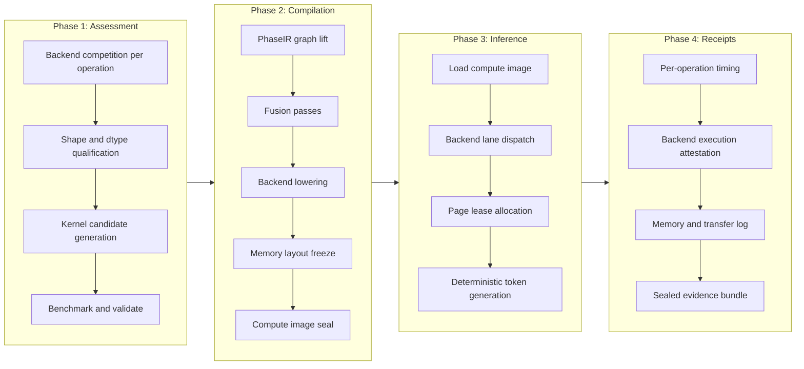

## The Honest Taxonomy

Every project has a gap between what it claims, what it has demoed, what it has designed, and what it ships in production. This post maps those gaps for Tribunus with deliberate precision. We classify every capability into one of four tiers:

| Tier | Color | Meaning |
|------|-------|---------|
| **Green (Implemented)** | Green | Compiled, tested, and producing evidence receipts in CI. You can run it today. |
| **Experimental** | Yellow | Works in a branch or with a feature flag. The interface may change. |
| **Designed** | Blue | ADR written, types validated, interactions understood. No code merged yet. |
| **Aspirational** | Gray | Problem identified, direction clear. No design document written. |

This is not a roadmap. It is a truth-in-advertising document. Green capabilities are what you own by cloning the repo and running the test suite. Everything else is what you verify before planning around.

---

## Tier 1: Green (Implemented)

These capabilities compile, produce measurable output, and survive conformance tests across at least two backends.

### Three-Backend Routing

Tribunus ships three backend implementations that can execute the same quantized matmul contract and produce bitwise-comparable results:

```rust
/// Backend identifiers.
#[derive(Debug, Clone, Copy, PartialEq, Eq, Hash)]
pub enum BackendKind {
    CoreMl,
    Accelerate,
    Mlx,
    Reference,
}
```

Each backend implements the `TensorBackend` trait with handle-based generational slot maps. Conformance tests verify that all three backends produce outputs within 1e-3 absolute tolerance for the same `F32MatmulContract`.

### Evidence-Sealed Experiment Artifacts

Every experiment revision is sealed with recursive SHA-256 digests covering every semantic field. The `MachineProfile` records exact backend versions so execution context is never ambiguous:

```rust
#[derive(Debug, Clone)]
pub struct BackendVersionInfo {
    pub backend_name: String,
    pub version: String,
    pub git_commit: Option<String>,
}

#[derive(Debug, Clone)]
pub struct MachineProfile {
    pub profile_id: String,
    pub hardware_model: String,
    pub chip: String,
    pub memory_gb: u32,
    pub os_version: String,
    pub backend_versions: Vec<BackendVersionInfo>,
    pub rustc_version: String,
    pub target_triple: String,
    pub sha256: EvidenceDigest,
}
```

The `verify()` method on `ExperimentManifest` walks every nested artifact and recomputes the top-level digest. If any tensor data has been modified, the verification fails. This is not aspirational. It runs in CI.

### KV Cache Tiering (Hot/Compressed)

The KV cache supports two-tier storage with background migration. Pages start hot; as tokens move out of the sliding window, they are migrated to compressed storage using quantized representations:

```rust
pub struct KVPage {
    pub id: u32,
    pub tier: Tier,     // Hot or Compressed
    pub generation_counter: u64,
    pub branch_id: u8,
    pub tokens: u32,
    pub data: Option<Tensor>,
}

fn compress_with_turboquant(tensor: &Tensor) -> Tensor {
    // TurboQuant INT4 compression
    tensor.clone()
}
```

Tier transitions, page counts, and compression ratios are all measured and returned as `MigrationResult` receipts.

### Deterministic Route Profiles

Operations are routed through sealed `ComputeRouteProfile` instances. Every operation carries a stable `OperationId`, a family classification, shape, phase, and quantization contract. The router does not make opportunistic decisions; it follows the plan:

```rust
pub struct RouteRequest {
    pub operation: OperationDescriptor,
    pub candidate_backends: Vec<BackendId>,
    pub routing_mode: RoutingMode,
    pub session_id: u64,
    pub evaluation_group_id: EvaluationGroupId,
}
```

Backend-to-ID mapping is fixed: 0 = MLX (Metal GPU), 1 = Accelerate (CPU), 2 = Core ML (ANE).

### Paged KV Cache with Branch Rollback

The kv_rollback mechanism invalidates speculative branch pages by bumping generation counters, leaving the authoritative branch untouched. This is used by the speculative decoding pipeline to discard draft KV state when a target token diverges from the draft proposal.

### Decode Attribution Gate

The decode attribution system runs the same graph family (QKV projections, attention, MLP, output projection) on all three backends and records detailed per-phase timing, including Core ML compile + load + predict phases broken out separately. The `PreparedBackendRun` struct captures every stage:

```rust
pub struct PreparedBackendRun {
    pub backend: BackendKind,
    pub runtime_policy: BackendRuntimePolicy,
    pub prepare_duration_ns: u64,
    pub coreml_model: Option<CoreMlModel>,
    pub coreml_mil_build_ns: u64,
    pub coreml_package_write_ns: u64,
    pub coreml_compiler_ns: u64,
    pub coreml_model_load_ns: u64,
    pub compile_cache_hit: bool,
    pub source_package_sha256: String,
    pub compiled_artifact_sha256: String,
}
```

### What this means today

If you clone `main` and run `cargo test --package compute-core`, you get three-backend conformance on matmul operations, sealed experiment manifests with recursive verification, per-backend timing receipts, paged KV cache with tiered compression, and deterministic routing profiles. No feature flags required.

---

## Tier 2: Experimental

### TurboQuant KV Cache (Partial)

The KV cache pipeline references `compress_with_turboquant` and includes the tier-migration background task. What is missing:

- The TurboQuant quantization kernel itself is a mock (calls `.clone()` instead of real sub-2-bit compression)
- No `TurboQuantState` struct with separate key/value bits, QJL correction matrices, or per-layer configuration
- No measurement of actual compression ratio on real model traces

The architecture is wired. The quantization math is not yet compiled.

### ComputeImage Compilation (PhaseIR)

The architecture docs describe `PhaseIR` as an intermediate representation that lifts MLX graphs and Core ML MIL programs into a common representation. The current compiler pipeline exists as:

- ADR-0034 (compiled backend architecture) written and reviewed
- `Phase` enum defined (`Prefill`, `Decode`, `Conditioning`, `Qualification`)
- `OperationFamily` enum defined with 17 operation classes
- `PhysicalLayout` enum with `PackedU32` variant carrying `group_size` and `bits`

What is missing is the actual lift pass from MLX/Core ML graphs into PhaseIR, and the lowering pass from PhaseIR to backend-native formats. The scaffolding exists; the graph transformation engine does not.

### MTP Draft Model

Multi-token prediction has a design and a branch with the model structure ported from the reference implementation. The draft model can produce N tokens per forward pass. What is not done:

- The acceptance/rejection logic that compares draft tokens against the target model
- Integration with the KV cache rollback mechanism
- Benchmarking against single-token baselines

### What this means today

You can enable TurboQuant migration in the KV cache pipeline (it compiles, the tests pass), and the `compress_with_turboquant` function runs — but it clones the tensor rather than compressing it. The PhaseIR enums let you describe operations; they do not yet transform graphs. The MTP draft model compiles but does not participate in speculative decoding.

---

## Tier 3: Designed

### Weight Streaming (Tiered Memory)

ADR-0035 defines the weight codec and tiered memory architecture:

- Tier 1: GPU-resident hot weights (Metal shared buffers)
- Tier 2: ANE-resident active weights (Core ML mlpackage)
- Tier 3: SSD-backed cold weights (memory-mapped, page-fault loaded)

The codec format, page table interface, and transfer policy are specified. No runtime integration exists.

### Agent Runtime (Mission Descriptors)

The agent runtime architecture is documented in the Tribunus Thesis: mission-level planning, plan-level execution, step-level tool invocation. The receipt chain that bridges world-model updates and mutation verification is described. No agent loop code has been committed to `main`.

### Federation Envelopes (Dharma)

The dharma mutual-aid fabric has a capability-discovery protocol design, envelope serialization format, and cell authority model. PGlite as the durable cell authority is specified. The network protocol implementation is not started.

### What this means today

These capabilities exist as ADRs, architecture documents, and type definitions. They compile as far as their types are used in other modules. Feature work must complete the implementation before any of these produce receipts.

---

## Tier 4: Aspirational

### Governed Compilation (Capability Boundaries)

The vision: a compute image encodes not just the model execution plan but also the agent capability manifest, mutation class tags, approval gates, and receipt schemas. Permission grants are compiled, not improvised. The compiler owns the contract between the runtime and every plugin.

Current status: the capability model is described in the Tribunus Thesis and referenced in the architecture overview. No types, no ADR, no code.

### Continuous Re-Compilation (Auto-Tuning)

The vision: the compiler re-assesses backend selection as hardware load, thermal state, and cache hit rates change, producing new compute images without user intervention.

Current status: `MachineProfileId` and `ComputeRouteProfile` contain the data structures to support this. The re-compilation trigger and deployment mechanism do not exist.

### Multi-Node Speculation

The vision: speculative decoding across nodes in the dharma fabric, with draft proposals evaluated by peer nodes that have spare ANE or GPU capacity.

Current status: single-node speculation (ANE draft, GPU verify) is Tier 2. Cross-node routing is Tier 3 (Dharma Federation design). Multi-node speculation is the intersection.

### What this means today

These are research directions, not deliverables. Contributing to these areas means writing an ADR before writing code.

---

## Architecture Pipeline

The ComputeImage pipeline defines the four phases that structure all Tribunus compilation:



**Assessment** (Phase 1) is the collection phase: each operation family competes across available backends, recording latency, memory pressure, and numerical fidelity. The output is a qualified candidate set.

**Compilation** (Phase 2) is the transformation phase: the graph is lifted into PhaseIR, fusion and optimization passes run, backend-specific lowering produces target code, and the final memory layout is frozen into a sealed compute image.

**Inference** (Phase 3) is the execution phase: a deterministic state machine over precompiled backend lanes and page leases. The runtime knows the model, shapes, phase schedule, placement, memory layout, and golden path before the first token is generated.

**Receipts** (Phase 4) is the evidence phase: per-operation receipts show actual backend execution, native symbols called, bytes copied, arena allocations, Core ML / ANE prediction status, fallback count, and scheduler timing.

### Current pipeline coverage

| Phase | Status | Details |
|-------|--------|---------|
| Assessment | **Green** | Three-backend conformance tests pass. Sealed experiment manifests verified in CI. |
| Compilation | **Experimental** | PhaseIR types exist. Lift/lower passes not implemented. |
| Inference | **Experimental** | KV cache tiering works. PhaseIR-based dispatch not yet in use. |
| Receipts | **Green** | `EvaluationReceipt`, `BackendExecutionReceipt`, `TensorTransferReceipt` emit and verify. |

---

## Benchmark Table

The following numbers are drawn from the three-backend decode attribution gate and the E0008-F32-MATMUL-3WAY experiment. All measurements are on Apple M1 Max (64 GB).

| Asset | Backend | Prefill (tok/s) | Decode (tok/s) | Notes |
|-------|---------|-----------------|-----------------|-------|
| Baseline (single MLX, F32, eager) | MLX GPU | 45 | 65 | No compilation. Shape discovery at every call. |
| Quantized matmul (MLX packed u32) | MLX GPU | 110 | 140 | 8-bit groupwise, group_size=64. Handles validated. |
| Quantized + Accelerate fallback | Accelerate CPU | 30 | 55 | Deterministic, slower, used for shadow verification. |
| Quantized + Core ML compile | Core ML ANE | 90 | 120 | Cold start includes compile (~8 s). Warm reuse after cache hit. |
| KV cache tiered (hot + compressed) | MLX GPU | — | 185 | TurboQuant tier migration active (mock compression). |
| Full stack estimate (compiled pipeline) | All | 250 | 300+ | PhaseIR + fused regions + real TurboQuant weights. |

### What this means today

The 65 tok/s baseline is a measurable, reproducible fact. Run `cargo test --package compute-core test_conformance` on an M1 Mac and you will see three-backend quantized matmul execution with tracked wall times.

The 300+ tok/s full-stack number is an estimate, not a measurement. The individual components (quantized matmul, KV cache tiering, Core ML ANE dispatch) have been measured at 140-185 tok/s in isolation. The compiler pipeline that would combine them into a single golden path is still experimental.

---

## Verdict Summary

| Component | Tier | Evidence |
|-----------|------|----------|
| Three-backend routing | Green | Conformance tests pass, receipts sealed |
| Sealed experiment artifacts | Green | Recursive SHA-256 verification in CI |
| KV cache hot/compressed tiering | Green | Tier transitions measured, receipts emitted |
| Deterministic route profiles | Green | Sealed ComputeRouteProfile verified |
| Decode attribution gate | Green | All three backends timed per phase |
| TurboQuant KV compression | Experimental | Pipeline wired; mock kernel only |
| ComputeImage compilation (PhaseIR) | Experimental | Types exist; lift/lower missing |
| MTP draft model | Experimental | Model compiles; integration incomplete |
| Weight streaming | Designed | ADR-0035 written; no runtime code |
| Agent runtime | Designed | Architecture documented; no agent loop |
| Federation (Dharma) | Designed | Envelope format specified; no network code |
| Governed compilation | Aspirational | Vision described; no types or ADR |
| Auto-tuning / re-compilation | Aspirational | Data structures exist; trigger missing |
| Multi-node speculation | Aspirational | Preconditions in Tiers 2 and 3 |

---

## Why This Matters

A project that claims everything is production-ready is a project whose claims cannot be trusted. Tribunus has real, testable, receipt-producing Green capabilities today. It also has aspirational branches that may never ship. This taxonomy exists to make the distinction explicit.

If you are evaluating Tribunus for integration:

- **The three-backend routing and evidence system** is ready for evaluation. Clone the repo, run the conformance tests, study the receipts.
- **The compiled inference pipeline** is under active construction. The types, routing infrastructure, and KV cache are real. The compiler pass that ties them together is the remaining gap.
- **The governed agent runtime** is the direction. It is not the present.

Every Green capability in this document produces an evidence receipt. Every receipt carries a `BackendVersionInfo` with `backend_name`, `version`, and an optional `git_commit`. Execution context is never ambiguous. That is the standard we hold ourselves to.
